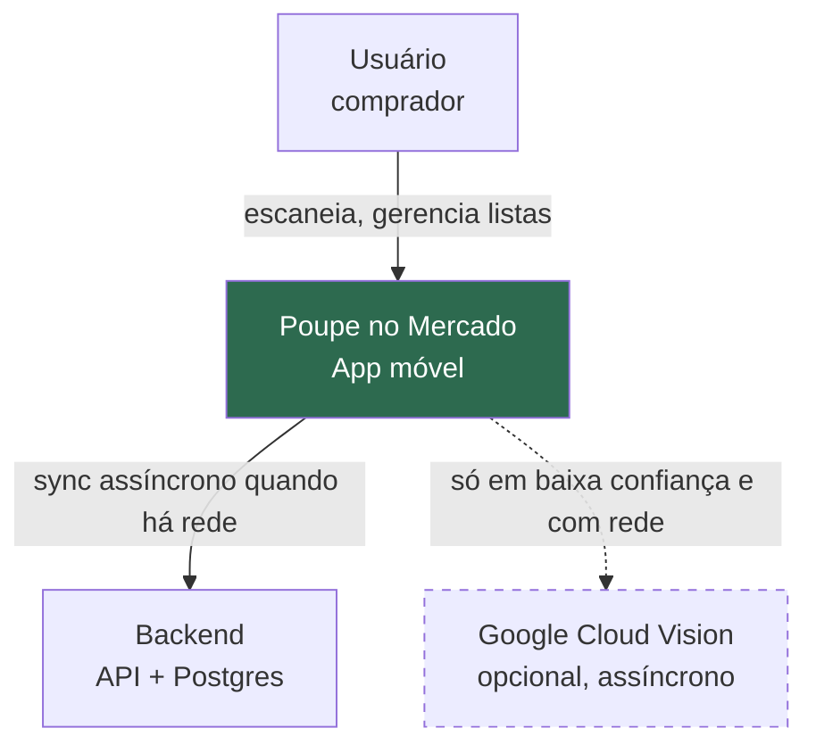
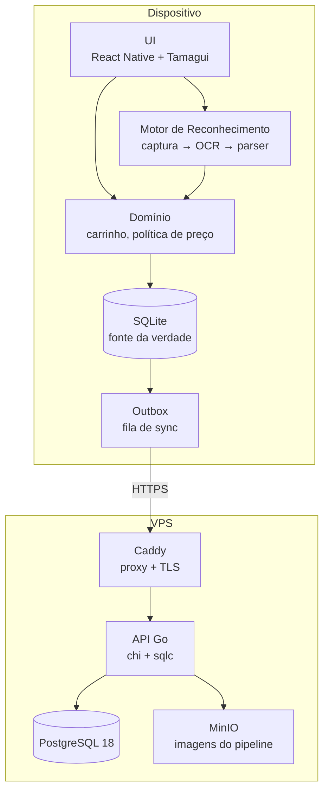
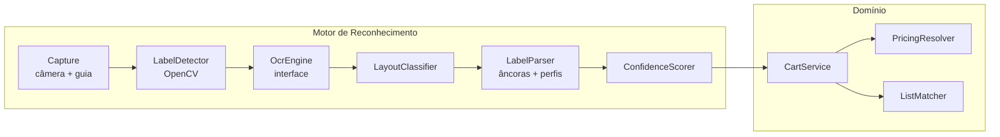

# 01 — Decisões Arquiteturais e Componentes

---

## Parte I — ADRs (Architecture Decision Records)

Cada decisão registra o contexto, a escolha e o que ela **custa**. Uma decisão sem
custo declarado é propaganda, não engenharia.

---

### ADR-001 — Offline-first com SQLite como fonte da verdade

**Status:** Aceito

**Contexto.** O momento de uso do app é dentro do supermercado — corredor de
freezer, subsolo, loja de alvenaria. Sinal ruim é a regra, não a exceção. Um app
que depende de rede para escanear não funciona exatamente quando é necessário.

**Decisão.** O SQLite no dispositivo é a fonte da verdade. O servidor é uma
réplica para backup e sincronização entre dispositivos. Toda escrita vai primeiro
ao SQLite, a UI atualiza imediatamente, e uma fila (*outbox*) sobe as mutações
quando houver rede.

**Consequências.**
- ✅ App 100% funcional sem rede; servidor pode cair por dias sem impacto
- ✅ UI instantânea — nenhum spinner de rede em fluxo crítico
- ❌ Sincronização e resolução de conflito passam a ser problema nosso
- ❌ Não há "verdade central" imediata — dados podem divergir temporariamente
- ❌ Migrations de schema precisam rodar em **dois** bancos

---

### ADR-002 — OCR on-device atrás de uma interface

**Status:** Aceito · **Motor específico:** a decidir por medição (`06-PLANO-VALIDACAO.md`)

**Contexto.** Três caminhos: OCR na nuvem, OCR on-device com biblioteca de
terceiro, ou OCR próprio (PaddleOCR/Tesseract). Restrições: funcionar offline,
custo marginal zero, e preferência do projeto por não depender de serviços
externos.

Distinção crítica que orientou a escolha:

| Tipo | Dados saem do device | Custo/leitura | Offline |
|---|---|---|---|
| Serviço de nuvem (Cloud Vision) | Sim | ~R$ 0,008 | Não |
| **Biblioteca local (ML Kit)** | **Não** | **R$ 0** | **Sim** |

ML Kit on-device é um binário embutido no APK. Não é um serviço — é a mesma
categoria de dependência que o próprio React Native.

**Decisão.** OCR on-device, atrás da interface `OcrEngine`. Nenhum código de
domínio conhece o motor concreto. O motor específico será escolhido por medição
empírica no Laboratório de Etiquetas, não por análise no papel.

**Consequências.**
- ✅ Offline e custo marginal zero — 10 mil usuários custam o mesmo que 10
- ✅ Nenhum dado sai do celular durante a compra
- ✅ Trocar de motor é mudar configuração, não reescrever
- ✅ Permite comparar motores no mesmo frame
- ❌ Camada de abstração a manter, e o menor denominador comum entre motores
- ❌ Motores diferentes reportam confiança de formas diferentes — precisa normalização

---

### ADR-003 — Preço é uma estrutura, nunca um escalar

**Status:** Aceito · **Esta é a decisão mais importante do projeto**

**Contexto.** A análise das etiquetas reais revelou que uma única etiqueta contém
até seis valores em reais, e o preço efetivo depende de três eixos independentes:
quantidade levada, meio de pagamento, e se a oferta está vigente.

O fluxo originalmente imaginado — *identificar produto → perguntar quantidade →
somar* — está invertido: **a quantidade determina o preço unitário**.

**Decisão.** O reconhecimento retorna `PricingPolicy`, não um número. O preço
efetivo é sempre computado por uma função pura:

```
resolvePrice(policy: PricingPolicy, qty: number, useStoreCard: boolean) → priceCents
```

Nenhuma parte do sistema armazena ou transporta "o preço do produto" como escalar.

**Consequências.**
- ✅ Habilita o diferencial competitivo (faixas dinâmicas)
- ✅ Mudar a quantidade recalcula corretamente, sem reescanear
- ✅ Modela a realidade em vez de simplificá-la e errar
- ❌ Modelo de dados e UI mais complexos que "produto tem preço"
- ❌ Todo consumidor de preço precisa saber a quantidade e o contexto

---

### ADR-004 — Monólito modular em Go

**Status:** Aceito

**Contexto.** Projeto solo, orçamento apertado, VPS única já existente com outras
cargas. Alternativas avaliadas: Java/Spring Boot (sugerido no levantamento
inicial), NestJS/TypeScript, e Go.

| | Memória base | Ponto forte |
|---|---|---|
| Spring Boot | ~500 MB | Maturidade, familiaridade |
| NestJS | ~80 MB | Tipos compartilhados com o app |
| **Go** | **~20 MB** | Menor consumo, binário único, deploy trivial |

**Decisão.** Go, monólito modular (não microsserviços), com `chi` + `sqlc` +
`pgx`. O contrato OpenAPI é a fonte única da verdade e gera stubs em Go e client
em TypeScript, recuperando boa parte da vantagem de tipos compartilhados que o
NestJS teria.

**Consequências.**
- ✅ ~20 MB de RAM; sobra folga na VPS compartilhada
- ✅ Imagem Docker `distroless` de ~15 MB; deploy em segundos
- ✅ `sqlc` dá SQL explícito + tipagem forte — bom para queries analíticas
- ❌ Perde compartilhamento nativo de tipos com o app (mitigado por OpenAPI)
- ❌ Mais verboso que TypeScript para CRUD simples
- ❌ Ecossistema menor que JVM para bibliotecas de negócio

**Rejeitado:** GORM. Ele acelera os primeiros CRUDs e cobra caro depois,
exatamente nas queries que importam aqui.

---

### ADR-005 — VPS única com Docker Compose

**Status:** Aceito

**Contexto.** Projeto solo, pré-receita. VPS própria já disponível: 12 GB RAM,
1 TB disco, com outras cargas rodando.

**Decisão.** Um servidor, Docker Compose, Caddy como proxy com TLS automático.
Explicitamente **não** Kubernetes.

**Consequências.**
- ✅ Custo marginal zero (infra já paga)
- ✅ Operação trivial: `docker compose up -d`
- ✅ Um arquivo descreve o sistema inteiro
- ❌ Ponto único de falha — aceitável porque o app funciona offline
- ❌ Escalar horizontalmente exige migração futura
- ❌ Concorre por recursos com as outras cargas da máquina

**Gatilho de revisão:** > 20 mil usuários ativos, ou p95 de sync > 3 s.

---

### ADR-006 — Foco regional inicial (rede Bahamas, Juiz de Fora/MG)

**Status:** Aceito

**Contexto.** Cada rede de supermercado tem layout de etiqueta próprio. Um parser
genérico funciona mal em todas; um parser especializado funciona muito bem em
uma. Temos 13 fotos reais de uma única rede.

**Decisão.** Otimizar agressivamente para os 4 layouts do Bahamas Mix. A
arquitetura suporta **perfis de layout** plugáveis, versionados e distribuíveis
por OTA, com um perfil genérico de fallback.

**Consequências.**
- ✅ Alta acurácia onde o produto será realmente testado
- ✅ Beta com usuários reais na mesma cidade
- ✅ Adicionar rede nova = adicionar perfil, não reescrever
- ❌ Fora da região a acurácia cai para o nível do perfil genérico
- ❌ Expansão geográfica exige coleta de fotos por rede

---

### ADR-007 — Entrada manual como caminho de primeira classe

**Status:** Aceito

**Contexto.** Nenhum OCR acerta 100%. Impressão matricial degradada, reflexo e
etiqueta amassada garantem falhas. Se o app travar quando o reconhecimento falhar,
o usuário abandona no meio da compra.

**Decisão.** A entrada manual não é plano B — é caminho de primeira classe,
sempre visível, a um toque. Confiança baixa não bloqueia: mostra o melhor palpite
como sugestão editável.

**Consequências.**
- ✅ O app nunca trava, independentemente da qualidade do OCR
- ✅ Reduz o risco do projeto: mesmo com OCR mediano, o produto funciona
- ✅ Correções do usuário viram sinal de treino
- ❌ Exige investimento de UX no teclado numérico e no fluxo de correção

---

### ADR-008 — Dinheiro como inteiro em centavos

**Status:** Aceito

**Contexto.** Uma compra soma ~50 itens. Ponto flutuante acumula erro de
arredondamento, e o produto inteiro se baseia na confiança do total.

**Decisão.** Todo valor monetário é `int` (TS) / `int64` (Go) / `BIGINT`
(Postgres), em centavos. Formatação para exibição só na borda da UI.

**Consequências.**
- ✅ Aritmética exata, sempre
- ❌ Conversão em toda borda de entrada/saída
- ❌ Preço por Kg com peso fracionário exige arredondamento explícito e documentado
  (regra: arredonda o **total do item**, meio-para-cima, nunca o unitário)

---

## Parte II — Visão de Componentes (C4)

### Nível 1 — Contexto



O único caminho obrigatório é `Usuário → App`. Tudo mais é opcional e assíncrono.

### Nível 2 — Contêineres



| Contêiner | Tecnologia | Responsabilidade |
|---|---|---|
| UI | RN + Tamagui | Telas, câmera, teclado numérico |
| Domínio | TypeScript puro | Carrinho, resolução de preço, matching de lista |
| Motor de Reconhecimento | TS + nativo | Captura → OCR → parser → confiança |
| SQLite | expo-sqlite + Drizzle | Persistência local, fonte da verdade |
| Outbox | TypeScript | Fila durável de mutações pendentes |
| Caddy | — | TLS automático, roteamento por subdomínio |
| API Go | chi + sqlc | Auth, sync, catálogo, perfis de layout |
| PostgreSQL | 18 + extensões | Réplica, catálogo canônico, histórico |
| MinIO | — | Imagens de baixa confiança (pipeline assíncrono) |

### Nível 3 — Componentes do app



**Regra de dependência:** o domínio nunca importa nada de `ocr/`. Ele recebe
`LabelReading` já pronto. Isso mantém a lógica de negócio testável sem câmera.

### Estrutura de diretórios prevista

```
PoupeNoMercado/
├── CLAUDE.md
├── IMPLEMENTACAO.md
├── docs/
├── Etiquetas/                    # fotos de origem
├── app/
│   ├── src/
│   │   ├── ocr/
│   │   │   ├── types.ts          # OcrEngine, OcrBlock, OcrResult
│   │   │   ├── engines/          # mlkit.ts, cloudvision.ts
│   │   │   ├── detector/         # recorte e retificação
│   │   │   ├── parser/           # ⭐ perfis, âncoras, gramática
│   │   │   └── confidence/
│   │   ├── domain/               # TS puro, sem I/O
│   │   │   ├── pricing.ts        # PricingPolicy, resolvePrice
│   │   │   ├── cart.ts
│   │   │   └── matching.ts
│   │   ├── db/                   # Drizzle: schema, migrations, outbox
│   │   ├── ui/                   # componentes Tamagui
│   │   ├── app/                  # rotas Expo Router
│   │   └── lab/                  # Laboratório de Etiquetas (Fase 0)
│   └── fixtures/                 # gabarito: fotos + JSON esperado
├── api/
│   ├── cmd/api/
│   ├── internal/{http,service,repo,domain}/
│   ├── db/{migrations,queries}/
│   └── openapi.yaml              # fonte única do contrato
└── infra/
    ├── docker-compose.yml
    ├── Caddyfile
    └── backup.sh
```
