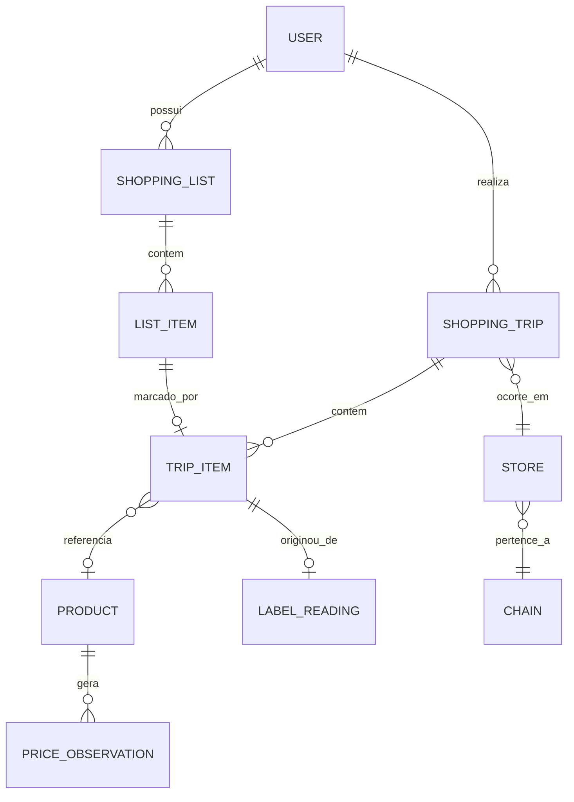

# 03 — Modelo de Dados e Sincronização

---

## 1. Princípios

1. **O SQLite do dispositivo é a fonte da verdade.** O Postgres é réplica.
2. **Dinheiro é `INTEGER`/`BIGINT` em centavos.** Nunca `REAL`, nunca `FLOAT`.
3. **Toda tabela sincronizável carrega:** `id` (UUID v7), `updated_at`,
   `deleted_at`, `device_id`.
4. **Exclusão é lógica** (`deleted_at`), nunca física — necessário para propagar
   remoções pelo sync.
5. **UUID v7** porque é ordenável por tempo: melhora localidade de índice e
   permite gerar IDs offline sem colisão.

---

## 2. Modelo conceitual



| Entidade | Papel |
|---|---|
| `USER` | Conta |
| `SHOPPING_LIST` | Lista de compras (template reutilizável) |
| `LIST_ITEM` | Item planejado |
| `SHOPPING_TRIP` | Sessão de compra — o carrinho ativo |
| `TRIP_ITEM` | Item efetivamente no carrinho, com política de preço e quantidade |
| `LABEL_READING` | Registro da leitura da etiqueta (auditoria e melhoria) |
| `PRODUCT` | Catálogo canônico |
| `CHAIN` / `STORE` | Rede e loja |
| `PRICE_OBSERVATION` | Histórico de preços — **Fase 3** |

---

## 3. Schema local (SQLite)

Definido com Drizzle ORM em `app/src/db/schema.ts`.

```sql
-- ─── Listas ───────────────────────────────────────────────────────────
CREATE TABLE shopping_list (
  id            TEXT PRIMARY KEY,            -- UUID v7
  name          TEXT    NOT NULL,
  budget_cents  INTEGER,                     -- teto opcional
  created_at    INTEGER NOT NULL,            -- epoch ms
  updated_at    INTEGER NOT NULL,
  deleted_at    INTEGER,
  device_id     TEXT    NOT NULL,
  sync_state    TEXT    NOT NULL DEFAULT 'pending'  -- pending|synced|conflict
);

CREATE TABLE list_item (
  id           TEXT PRIMARY KEY,
  list_id      TEXT    NOT NULL REFERENCES shopping_list(id),
  name         TEXT    NOT NULL,
  qty_planned  REAL,
  unit         TEXT    NOT NULL DEFAULT 'UN',   -- UN|KG|L|M
  checked      INTEGER NOT NULL DEFAULT 0,
  position     INTEGER NOT NULL DEFAULT 0,
  category     TEXT,
  created_at   INTEGER NOT NULL,
  updated_at   INTEGER NOT NULL,
  deleted_at   INTEGER,
  device_id    TEXT    NOT NULL
);
CREATE INDEX idx_list_item_list ON list_item(list_id) WHERE deleted_at IS NULL;

-- ─── Compra (carrinho) ────────────────────────────────────────────────
CREATE TABLE shopping_trip (
  id            TEXT PRIMARY KEY,
  list_id       TEXT REFERENCES shopping_list(id),
  store_id      TEXT,
  store_name    TEXT,
  budget_cents  INTEGER,
  status        TEXT    NOT NULL DEFAULT 'active',  -- active|finished|abandoned
  use_store_card INTEGER NOT NULL DEFAULT 0,        -- afeta resolvePrice
  started_at    INTEGER NOT NULL,
  finished_at   INTEGER,
  total_cents   INTEGER NOT NULL DEFAULT 0,         -- desnormalizado, recalculado
  created_at    INTEGER NOT NULL,
  updated_at    INTEGER NOT NULL,
  deleted_at    INTEGER,
  device_id     TEXT    NOT NULL
);

CREATE TABLE trip_item (
  id            TEXT PRIMARY KEY,
  trip_id       TEXT    NOT NULL REFERENCES shopping_trip(id),
  list_item_id  TEXT REFERENCES list_item(id),   -- se casou com a lista
  product_id    TEXT,

  raw_name        TEXT    NOT NULL,
  normalized_name TEXT    NOT NULL,
  internal_code   TEXT,
  ean             TEXT,

  -- PricingPolicy serializada. Ver 02-MOTOR-RECONHECIMENTO.md §5.
  pricing_policy  TEXT    NOT NULL,   -- JSON

  -- Snapshot resolvido no momento do registro
  qty              REAL    NOT NULL,
  sale_unit        TEXT    NOT NULL,
  unit_price_cents INTEGER NOT NULL,
  total_cents      INTEGER NOT NULL,

  entry_mode      TEXT    NOT NULL,   -- scan|manual|scan_corrected
  confidence      REAL,
  reading_id      TEXT REFERENCES label_reading(id),

  created_at INTEGER NOT NULL,
  updated_at INTEGER NOT NULL,
  deleted_at INTEGER,
  device_id  TEXT    NOT NULL
);
CREATE INDEX idx_trip_item_trip ON trip_item(trip_id) WHERE deleted_at IS NULL;

-- ─── Auditoria de leitura ─────────────────────────────────────────────
CREATE TABLE label_reading (
  id                TEXT PRIMARY KEY,
  trip_id           TEXT,
  engine_id         TEXT    NOT NULL,
  layout_profile_id TEXT    NOT NULL,
  latency_ms        INTEGER NOT NULL,
  confidence_score  REAL    NOT NULL,
  confidence_level  TEXT    NOT NULL,
  weak_fields       TEXT,             -- JSON array
  failed_rules      TEXT,             -- JSON array
  ocr_raw           TEXT,             -- JSON dos OcrBlock[]
  parsed_result     TEXT,             -- JSON do LabelReading
  image_path        TEXT,             -- caminho local; só se baixa confiança
  user_corrected    INTEGER NOT NULL DEFAULT 0,
  corrected_value   TEXT,             -- JSON com o que o usuário corrigiu
  uploaded_at       INTEGER,          -- null = ainda não subiu
  created_at        INTEGER NOT NULL
);
CREATE INDEX idx_reading_pending_upload
  ON label_reading(created_at) WHERE uploaded_at IS NULL;

-- ─── Cache de catálogo (vem do servidor) ──────────────────────────────
CREATE TABLE product_cache (
  id              TEXT PRIMARY KEY,
  ean             TEXT,
  internal_code   TEXT,
  chain           TEXT,
  canonical_name  TEXT NOT NULL,
  normalized_name TEXT NOT NULL,
  category        TEXT,
  default_unit    TEXT,
  synced_at       INTEGER NOT NULL
);
CREATE INDEX idx_product_ean      ON product_cache(ean);
CREATE INDEX idx_product_internal ON product_cache(chain, internal_code);

-- ─── Perfis de layout (atualizáveis por OTA) ──────────────────────────
CREATE TABLE layout_profile (
  id        TEXT PRIMARY KEY,
  version   INTEGER NOT NULL,
  chain     TEXT    NOT NULL,
  spec      TEXT    NOT NULL,   -- JSON do LayoutProfile
  synced_at INTEGER NOT NULL
);

-- ─── Outbox (fila de sincronização) ───────────────────────────────────
CREATE TABLE outbox (
  seq         INTEGER PRIMARY KEY AUTOINCREMENT,
  entity      TEXT    NOT NULL,
  entity_id   TEXT    NOT NULL,
  op          TEXT    NOT NULL,   -- upsert|delete
  payload     TEXT    NOT NULL,   -- JSON do estado completo
  created_at  INTEGER NOT NULL,
  attempts    INTEGER NOT NULL DEFAULT 0,
  last_error  TEXT
);
CREATE INDEX idx_outbox_order ON outbox(seq);

CREATE TABLE sync_state (
  key   TEXT PRIMARY KEY,     -- ex: 'last_pull_cursor'
  value TEXT NOT NULL
);
```

### Por que `pricing_policy` é JSON

A política tem cardinalidade variável (0..N faixas) e é **imutável após a
leitura** — é um registro histórico do que a etiqueta dizia naquele momento.
Normalizá-la em tabelas criaria joins em todo carregamento de carrinho sem
nenhum ganho, já que nunca se consulta "todos os itens com faixa de 3+".

Se a Fase 3 exigir análise agregada de faixas, criamos uma tabela derivada
alimentada no servidor — sem mudar o modelo local.

---

## 4. Schema remoto (PostgreSQL 18)

```sql
CREATE EXTENSION IF NOT EXISTS pg_trgm;
CREATE EXTENSION IF NOT EXISTS unaccent;
CREATE EXTENSION IF NOT EXISTS btree_gin;

-- ─── Identidade ───────────────────────────────────────────────────────
CREATE TABLE app_user (
  id            UUID PRIMARY KEY,
  email         CITEXT UNIQUE NOT NULL,
  password_hash TEXT   NOT NULL,           -- argon2id
  display_name  TEXT,
  plan          TEXT   NOT NULL DEFAULT 'free',  -- free|premium
  created_at    TIMESTAMPTZ NOT NULL DEFAULT now(),
  updated_at    TIMESTAMPTZ NOT NULL DEFAULT now(),
  deleted_at    TIMESTAMPTZ
);

CREATE TABLE device (
  id            UUID PRIMARY KEY,
  user_id       UUID NOT NULL REFERENCES app_user(id),
  platform      TEXT NOT NULL,
  app_version   TEXT,
  last_seen_at  TIMESTAMPTZ,
  created_at    TIMESTAMPTZ NOT NULL DEFAULT now()
);

CREATE TABLE refresh_token (
  id          UUID PRIMARY KEY,
  user_id     UUID NOT NULL REFERENCES app_user(id),
  device_id   UUID NOT NULL REFERENCES device(id),
  token_hash  TEXT NOT NULL,
  expires_at  TIMESTAMPTZ NOT NULL,
  revoked_at  TIMESTAMPTZ,
  created_at  TIMESTAMPTZ NOT NULL DEFAULT now()
);

-- ─── Réplica das entidades do app ─────────────────────────────────────
-- Mesmas colunas do SQLite, com tipos nativos.
-- server_seq é o cursor monotônico usado pelo pull incremental.

CREATE SEQUENCE sync_seq;

CREATE TABLE shopping_list (
  id           UUID PRIMARY KEY,
  user_id      UUID   NOT NULL REFERENCES app_user(id),
  name         TEXT   NOT NULL,
  budget_cents BIGINT,
  created_at   TIMESTAMPTZ NOT NULL,
  updated_at   TIMESTAMPTZ NOT NULL,
  deleted_at   TIMESTAMPTZ,
  device_id    UUID   NOT NULL,
  server_seq   BIGINT NOT NULL DEFAULT nextval('sync_seq')
);
CREATE INDEX idx_list_sync ON shopping_list(user_id, server_seq);

-- list_item, shopping_trip, trip_item: mesma forma.
-- trip_item.pricing_policy é JSONB (não TEXT) no Postgres.

-- ─── Catálogo canônico ────────────────────────────────────────────────
CREATE TABLE chain (
  id   UUID PRIMARY KEY,
  name TEXT NOT NULL,
  slug TEXT UNIQUE NOT NULL
);

CREATE TABLE store (
  id         UUID PRIMARY KEY,
  chain_id   UUID NOT NULL REFERENCES chain(id),
  name       TEXT NOT NULL,
  city       TEXT,
  state      CHAR(2),
  location   POINT,               -- opt-in, Fase 3
  created_at TIMESTAMPTZ NOT NULL DEFAULT now()
);

CREATE TABLE product (
  id              UUID PRIMARY KEY,
  ean             TEXT UNIQUE,
  canonical_name  TEXT NOT NULL,
  normalized_name TEXT NOT NULL,
  brand           TEXT,
  category        TEXT,
  default_unit    TEXT NOT NULL DEFAULT 'UN',
  package_size    TEXT,
  created_at      TIMESTAMPTZ NOT NULL DEFAULT now(),
  updated_at      TIMESTAMPTZ NOT NULL DEFAULT now()
);

-- Busca fuzzy insensível a acento — resolve o desafio de nomes truncados
CREATE INDEX idx_product_trgm
  ON product USING gin (unaccent(normalized_name) gin_trgm_ops);

-- Código interno é por rede: "65954" no Bahamas ≠ "65954" em outra rede
CREATE TABLE product_chain_code (
  chain_id      UUID NOT NULL REFERENCES chain(id),
  internal_code TEXT NOT NULL,
  product_id    UUID NOT NULL REFERENCES product(id),
  PRIMARY KEY (chain_id, internal_code)
);

-- ─── Perfis de layout ─────────────────────────────────────────────────
CREATE TABLE layout_profile (
  id         TEXT PRIMARY KEY,
  version    INTEGER NOT NULL,
  chain_id   UUID REFERENCES chain(id),
  spec       JSONB   NOT NULL,
  active     BOOLEAN NOT NULL DEFAULT true,
  updated_at TIMESTAMPTZ NOT NULL DEFAULT now()
);

-- ─── Pipeline de melhoria ─────────────────────────────────────────────
CREATE TABLE label_reading_sample (
  id                UUID PRIMARY KEY,
  user_id           UUID REFERENCES app_user(id),
  chain_id          UUID REFERENCES chain(id),
  engine_id         TEXT NOT NULL,
  layout_profile_id TEXT NOT NULL,
  confidence_score  REAL NOT NULL,
  ocr_raw           JSONB,
  parsed_result     JSONB,
  user_corrected    BOOLEAN NOT NULL DEFAULT false,
  corrected_value   JSONB,
  image_key         TEXT,            -- chave no MinIO
  reviewed          BOOLEAN NOT NULL DEFAULT false,
  created_at        TIMESTAMPTZ NOT NULL DEFAULT now()
);
CREATE INDEX idx_sample_review
  ON label_reading_sample(created_at) WHERE reviewed = false;

-- ─── Histórico de preços — FASE 3, criar só quando chegar lá ──────────
-- CREATE TABLE price_observation (...) PARTITION BY RANGE (observed_at);
```

---

## 5. Sincronização

### 5.1 Modelo

**Push/pull incremental com cursor**, LWW (*last-write-wins*) por entidade.

```
┌── PUSH ──────────────────────────────────────────┐
│ App drena outbox em lotes de 50                  │
│   POST /v1/sync/push { mutations: [...] }        │
│ Servidor aplica com LWW e devolve conflitos      │
│ App marca como sincronizado ou resolve conflito  │
└──────────────────────────────────────────────────┘
┌── PULL ──────────────────────────────────────────┐
│ GET /v1/sync/pull?cursor=<server_seq>&limit=200  │
│ Servidor devolve entidades com server_seq > cursor│
│ App faz upsert local e avança o cursor           │
└──────────────────────────────────────────────────┘
```

### 5.2 Resolução de conflito (LWW por entidade)

```
Recebe mutação M para entidade E:
  1. Se E não existe local → insere
  2. Se M.updated_at > E.updated_at → substitui
  3. Se M.updated_at < E.updated_at → descarta (servidor devolve o vencedor)
  4. Empate exato → desempata por device_id lexicográfico (determinístico)
```

**Limitação assumida no MVP.** LWW por entidade perde escrita concorrente em
campos diferentes da mesma entidade. Para o MVP isso é aceitável: um usuário, um
dispositivo por vez, e o carrinho ativo é local por natureza.

**Gatilho de evolução:** a Fase 2 (lista colaborativa) **exige** granularidade
por campo. O caminho previsto:

- `list_item.checked` vira LWW por campo com timestamp próprio
- `list_item.qty_planned` idem
- Alternativa: LWW-Element-Set (CRDT) para a coleção de itens

Isso está isolado em `app/src/db/sync.ts` — trocar a estratégia não afeta a UI.

### 5.3 Regras de gatilho

| Evento | Ação |
|---|---|
| Volta de background com rede | Push + pull |
| Compra finalizada | Push imediato |
| A cada 15 min com app aberto e rede | Push + pull |
| Conectou no Wi-Fi | Push + pull + upload de amostras de imagem |
| Sem rede | Nada — outbox acumula indefinidamente |

### 5.4 O que **não** sincroniza

| Dado | Por quê |
|---|---|
| `label_reading.ocr_raw` completo | Volume alto, valor baixo — só sobe amostra de baixa confiança |
| `label_reading.image_path` | Imagem só via upload explícito no Wi-Fi |
| `product_cache` | Só pull, nunca push |
| `layout_profile` | Só pull |
| `outbox` | Estrutura local |

### 5.5 Upload de amostras (opt-in)

Só ocorre se: (a) usuário consentiu, (b) confiança < 0.60 ou houve correção,
(c) conexão Wi-Fi, (d) app em primeiro plano.

Imagens vão para o MinIO com chave opaca e **sem metadados EXIF** (removidos no
device). Retenção de 180 dias. Ver `05-INFRAESTRUTURA.md` §LGPD.

---

## 6. Migrations

| Ambiente | Ferramenta | Local |
|---|---|---|
| SQLite (app) | Drizzle Kit | `app/src/db/migrations/` |
| PostgreSQL | goose | `api/db/migrations/` |

**Regras:**

- Toda migration é *forward-only*. Corrigir erro = nova migration.
- Nunca editar migration já aplicada em produção.
- Migration do app roda no boot, antes da primeira query.
- Manter compatibilidade retroativa por ≥ 2 versões do app: usuários com app
  desatualizado precisam continuar sincronizando.

---

## 7. Estimativa de volume

| Métrica | Valor |
|---|---|
| Itens por compra | ~40 |
| Compras/usuário/mês | ~4 |
| `trip_item` por usuário/ano | ~1.900 |
| Tamanho médio de `trip_item` | ~600 B (com JSON da política) |
| **Por usuário/ano** | **~1,2 MB** |
| **10 mil usuários / 3 anos** | **~36 GB** |

Com 1 TB de disco na VPS, o dimensionamento é confortável por vários anos —
inclusive com espaço para o histórico de preços da Fase 3.
